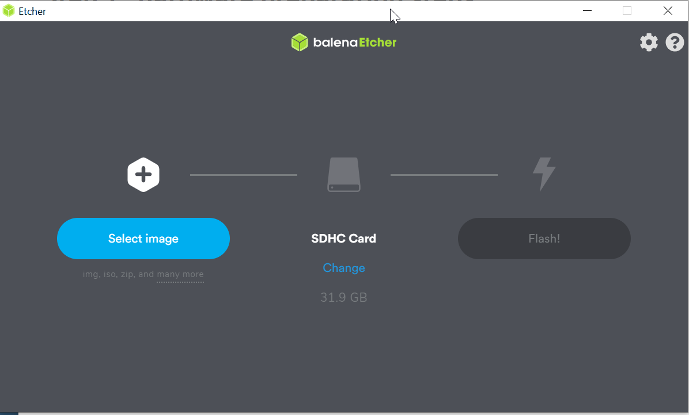
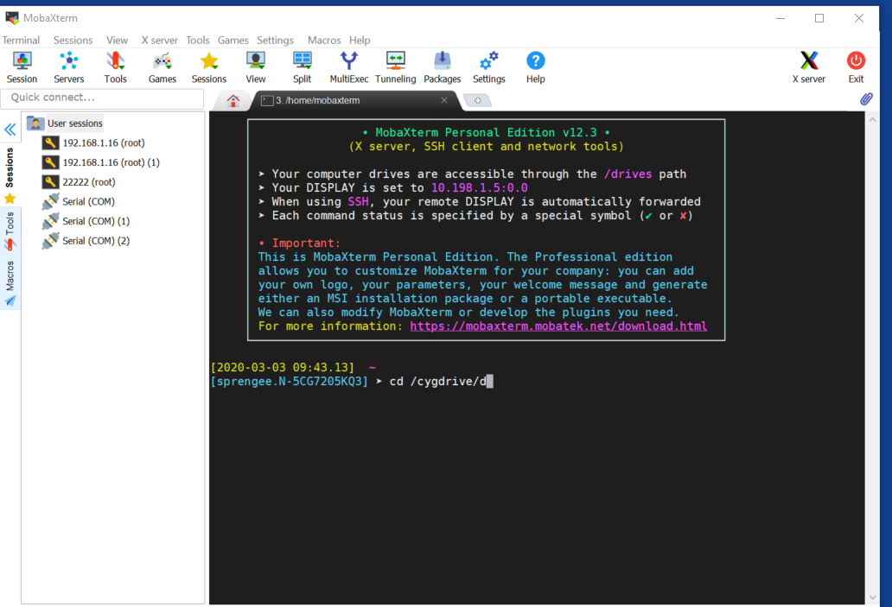

# Installation home assistant on raspbian with docker

The assumption is that the installation is done from PC/laptop without windows installed.

## Step 1 : hardware preparation steps

Download raspbian lite (not desktop) via https://www.raspberrypi.org/downloads/raspbian/ and unzip the image file (something like 2020-02-13-raspbian-buster-lite.img).  Store the image file somewhere in a folder.

Install the following (free) packages on your pc or laptop :

- MobaXterm (home edition) : https://mobaxterm.mobatek.net/download.html
- Balena Etcher : https://www.balena.io/etcher/

A rasberry pi device needs a micro SD card (32GB is adviced).  Put the card in an adapter in plugin it in your laptop/pc.  I assume that the card is discovered as D: drive (can be a different letter in your case, please replace D: by what you discover on your laptop/PC).  I am using a rasberry pi 3 model B. 

## Step 2 : Burn the raspbian image to the micro SD card

Insert the SD card in your computer and open the Balena Etcher application, select the above mentioned image file, select the SD card (in my case the D: driver) and press the flash button

The tool will write the image file to the SD card and verify it.  It is important that this step does not fail !




## Step 3. Prepare the SD card for wifi connectivity / ssh access

Reinsert the SD card in your laptop/PC, Open MobaXterm and start a local terminal



Execute the follow commands in the terminal :

```
cd /cygdrive/d
touch ssh
touch wpa_supplicant.conf
edit wpa_supplicant.conf
```

Forsee the following text in the wpa_supplicant.conf file :

```
country=US
ctrl_interface=DIR=/var/run/wpa_supplicant GROUP=netdev
update_config=1

network={
    ssid="NETWORK-NAME"
    psk="NETWORK-PASSWORD"
}
```

Lookup your country code in https://en.wikipedia.org/wiki/List_of_ISO_3166_country_codes

Fill in NETWORK-NAME and NETWORK-PASSWORD

- NETWORK-PASSWORD is your wifi password
- NETWORK-NAME can be found with for instance the android app SSID finder when your wifi router is in reach of your phone.

Don't forget to save the file after you have made all the necessary changes.  Eject now the SD card safely from the laptop/PC.

## Step 4.  Power up the rasberry PI

Insert the micro SD card in the rasberry PI, put it in reach of your WIFI router and give the device some power.  Wait now a couple of minutes, take a coffee.

## Step 5. SSH to the rasberry pi with your mobaxterm application

Go to the local terminal and enter following command.

```
ssh pi@192.168.1.21
```

The IP can be looked with for instance the android app called fing.  This app will find the IP address of the raspberry PI if your phone is connected to the same WIFI network.

Alternatively and if you are lucky (your router supports MDNS), you can use the hostname instead of the IP address.

```
ssh pi@raspberrypi.local
```

The default password is **raspberry**, change it to some safe password first.

## Step 6.  Install some prerequisite software on your PI

Copy/paste following text in your ssh session

```
sudo apt update && sudo apt dist-upgrade -y && sudo apt autoremove
sudo -i
apt-get install software-properties-common
apt-get update
apt-get install -y apparmor-utils apt-transport-https avahi-daemon ca-certificates curl dbus jq network-manager socat
curl -fsSL get.docker.com | sh
```

```
curl -sL "https://raw.githubusercontent.com/home-assistant/hassio-installer/master/hassio_install.sh" | bash -s -- -m raspberrypi3
```

```
sudo docker run -d -p 9000:9000 --name portainer --restart always -v /var/run/docker.sock:/var/run/docker.sock -v portainer_data:/data portainer/portainer
sudo reboot
```

Fire up now a browser and enter the IP address of the your PI on port 8123 (e.g. http://192.168.1.21:8123)

Once the installation is completed, create an account in home asisstant.